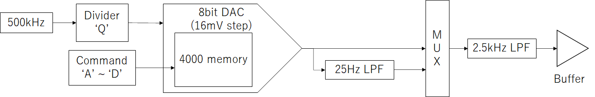

# USB制御電圧源

USB制御電圧源VG01はお手軽に参照電圧を発生させるために、USBによる制御、BNCコネクタ出力、独立した4ch出力を備えた電圧源です。
実験中のちょっとした電圧（参照電圧、制御電圧）にお使いください。

## 仕様

|項目|値|補足|
|:--|:--|:--|
|電源電圧|5V±0.25V|USBハイパワーポートの範囲（4.75V~5.25V）|
|消費電流|50mA|静止時|
|出力端子|BNC端子|4ch|
|出力電圧範囲|100mV ~ 4000mV|1mVステップ設定|

## 電圧生成方式



VG01は4chの独立した8bit DACと4000サンプル分のメモリを用いて任意波形発生器(AWG)のように電圧を生成します。
基準クロックには500kHzを分周したものを使い、最も早くて250kHzです（分周比2）。
出力には2.5kHzもしくは25Hz（default）のローパスフィルタ(LPF)が備えられています。
12bit精度（1mVステップ）を得る場合、デルタシグマ変調を用いて波形パターンを作成することで低雑音の出力を得ることが出来ます。
[VG01クラスのgen_constant_wo_calibrationメソッド](./vg01.py)を参考にしてください。
また、高精度の出力電圧を得るためには、校正値を用いて波形パターンを作成することが必要です。
校正値の取得は[VG01クラスのread_paramsメソッドおよびclass Param](./vg01.py)、校正した電圧の求め方は[VG01クラスの_correctedmvoltメソッド](./vg01.py)、を参考にしてください。

## 使い方

Windows PCとUSBケーブルで接続することでCOMポートとして認識されます。
そのCOMポートに対してASCIIコードを送ることでVG01と対話でき、電圧出力が行えます。
最初のアルファベットでコマンド種別を選択し、続く16進数（0~F）で設定値を指定します。
設定値がある場合は制御コマンド、ない場合は読み出しコマンドとして判断されます。
最初のアルファベット、コマンド指定以降の16進数以外は無視されます。

コマンドの例

```text
I2 # CH2から電圧を出力
I 2 # 上と同じ
A # CH0の状態を読み出す
```

コマンドの終端は'CR'です。

### サンプルスクリプト

[example_gui.py](./example_gui.py)がGUIのサンプルスクリプトです。
必要な外部パッケージは以下のとおりです。

- pySerial

### 制御コマンド一覧

 コマンド | 設定範囲 | 初期値 | 詳細
 --------| :------: | :----: | ----
A | 4 ~ 4000サンプル | - | ch0の波形パターンを設定する
B | 4 ~ 4000サンプル | - | ch1の波形パターンを設定する
C | 4 ~ 4000サンプル | - | ch2の波形パターンを設定する
D | 4 ~ 4000サンプル | - | ch3の波形パターンを設定する
I | 0 ~ 3 | - | 指定したchの出力をON（1）にする
O | 0 ~ 3 | - | 指定したchの出力をOFF（0）にする
Q | 2 ~ 2^16-1 | 2 | サンプリングの分周比を設定する。基準クロックは500kHz
S | 0 ~ 3 | - | 指定したchのLPFを25Hz LPFにする(default)
T | 0 ~ 3 | - | 指定したchの2.5kHz LPFにする
Z | - | - | 予約（使用しないこと）

## 読み出しコマンド一覧

コマンド | 戻り値 | 詳細
------- | :----: | ---
A | 文字列 | ch0の状態を返す
B | 文字列 | ch1の状態を返す
C | 文字列 | ch2の状態を返す
D | 文字列 | ch3の状態を返す
H | 文字列 | ハードウェア情報を文字列で返す
P | 20 Bytes | 校正値を返す
Z | なし | Bootloaderを起動する

# ファームウェアの更新

'Z'コマンドでBootloaderに入ることでmicro USB端子からファームウェアを更新出来ます。

## 手順

通常使用時と同じくmicro USB端子経由でUSB接続します。
COMポートに接続し、'Z'コマンドを送信してbootloaderに入ります。
PSoC Createorのメニュー[Tools] -> [Bootloader Host...]からBootloader Hostを起動しcyacdファイルを書き込みます。

1. 'Z'コマンドでBootloaderに入る（pythonやTera Term等を使用）
1. Bootloader HostでUSB Human Interface Deviceを選択
1. 更新用のcyacdファイルを指定
1. 書き込み実行


